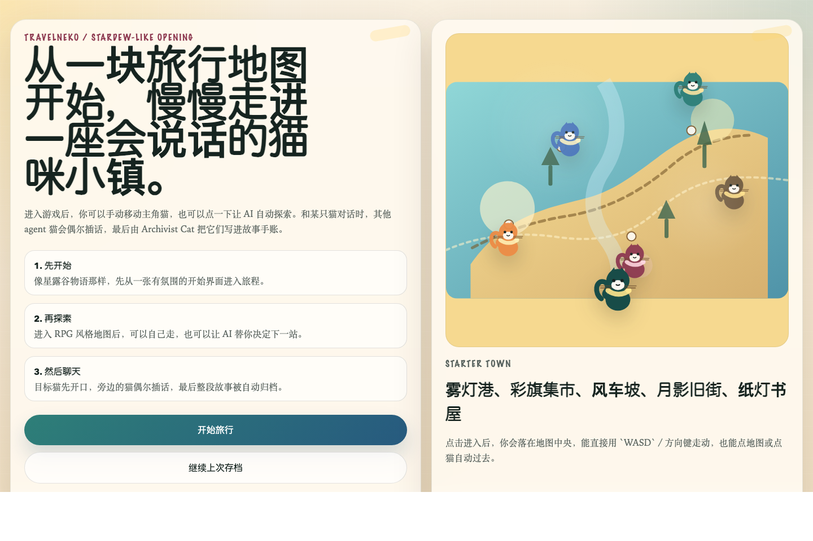
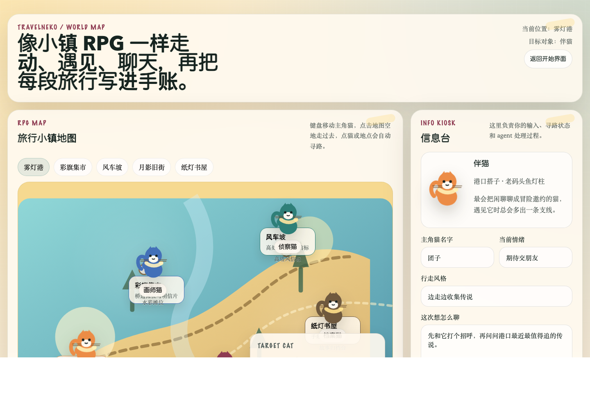
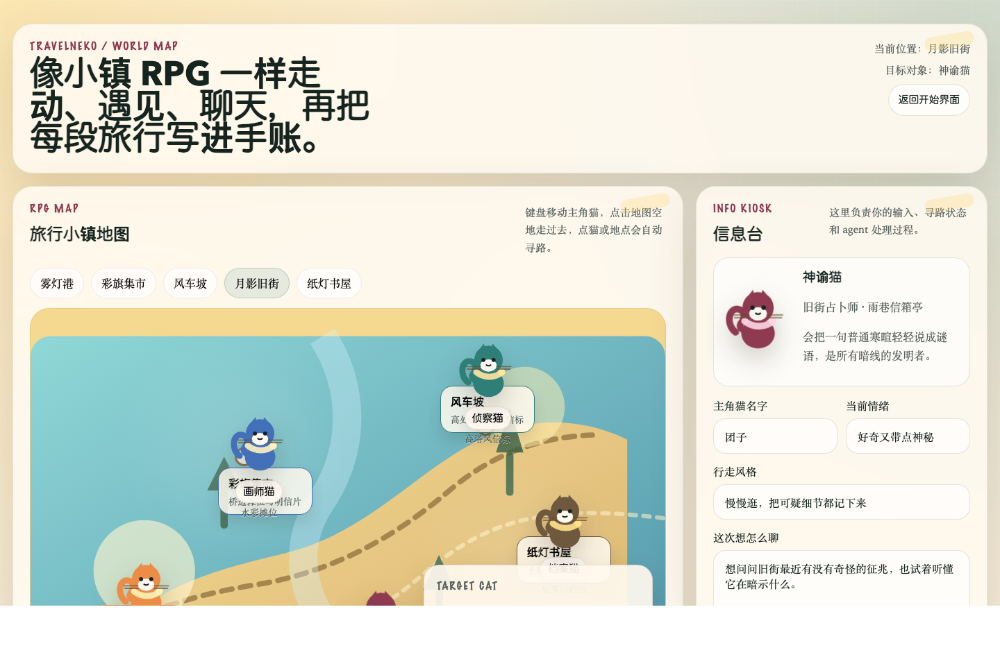
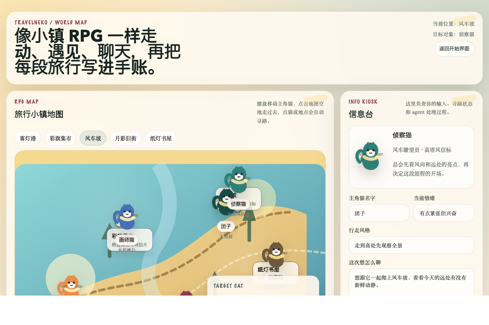
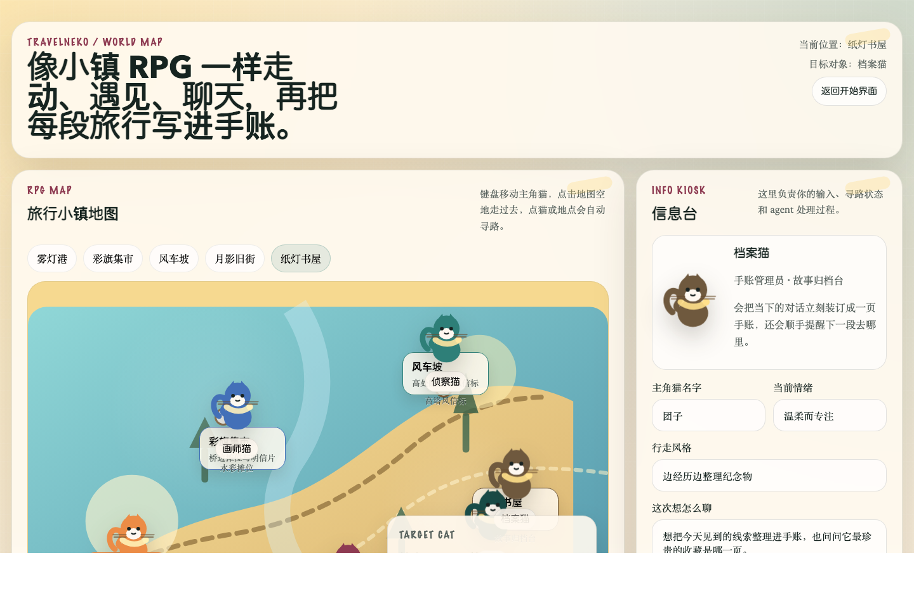

# TravelNeko

TravelNeko 是一个带有多 Agent 叙事能力的旅行猫咪小游戏原型。

它不是传统的“聊天工具壳”，而是一个更接近小镇 RPG / 星露谷式入口体验的网页游戏：

- 先进入一个氛围化的开始界面
- 再进入可探索的地图世界
- 主角猫可以手动移动，也可以点击让 AI 自动探索
- 与某只猫互动时，其他猫咪 Agent 会偶尔插话
- 每次相遇都会自动沉淀成一篇旅行手账记录

## Why This Project

TravelNeko 想验证一件事：

能不能把 LLM 多 Agent 协作，从“后台编排”变成“玩家可感知的游戏体验”。

在这个项目里，多 Agent 不只是隐藏在 API 后面做文本拼接，而是明确承担不同游戏角色：

- `Scout Cat` 负责布置遭遇、天气、氛围和场景挑战
- `Companion Cat` 负责组织对话，让目标猫先开口
- `Oracle Cat` 负责把暗线、伏笔和隐藏线索压进剧情
- `Archivist Cat` 负责把相遇整理成一篇完整的旅行手账
- `Painter Cat` 可选生成明信片草图 prompt

## Screenshot Gallery

### 1. Start Screen

项目首先进入一个类似星露谷物语风格的开始页，而不是直接落到表单工具界面。



### 2. World Exploration

进入游戏后就是 RPG 风格地图。玩家可以用键盘移动，也可以点击区域或猫咪自动寻路。



### 3. NPC Dialogue

与目标猫对话时，目标猫优先响应，附近其他猫咪会偶尔插话，形成更像“现场发生”的交流感。



### 4. AI Auto Explore Kiosk

右侧的信息台负责展示多 Agent 处理过程，也支持一键触发 AI 自动探索。



### 5. Archive / Journal View

一次相遇结束后，故事摘要、正文、对话、Agent 注释和纪念物都会进入手账档案。



## Core Gameplay Loop

### 1. Enter The World

玩家从开始界面进入旅行小镇。

当前地图区域包括：

- 雾灯港
- 彩旗集市
- 风车坡
- 月影旧街
- 纸灯书屋

### 2. Move The Cat

主角猫支持两种探索方式：

- 手动移动：`WASD` / 方向键
- 自动移动：点击地图空地、区域按钮或 NPC

### 3. Trigger An Encounter

玩家可以：

- 主动靠近某只猫，再发起对话
- 直接使用信息台触发一次手动交流
- 点击 `AI 自动探索`，让系统自主决定下一站和相遇对象

### 4. Multi-Agent Conversation

一次遭遇会进入可见的多 Agent 流程：

1. `Pathfinding`
2. `Info Kiosk`
3. `Scout Cat`
4. `Companion Cat`
5. `Oracle Cat`
6. `Archivist Cat`

这个阶段不是隐藏的内部黑箱，而是通过右侧信息台持续反馈给玩家。

### 5. Persist The Story

每次相遇都会被保存到本地旅行档案中，包括：

- 玩家输入
- 地图区域与目标猫
- 场景信息
- 对话片段
- 隐藏线索
- 故事摘要
- 手账正文
- 纪念物
- Agent 注释卡片

## Current Feature Set

### Gameplay

- 开始界面 + 世界地图双阶段体验
- RPG 风格地图探索页面
- SVG 猫咪角色和区域化地图
- 手动移动与自动寻路
- AI 自动探索模式
- 对话触发与实时信息台
- 对话后故事自动归档

### Narrative / Agent System

- 多 Agent 协同故事生成
- 目标猫优先发言
- 邻近猫咪偶尔插话
- 故事中包含场景推进、互动、暗线、总结、纪念物
- 明信片草图 prompt 生成能力

### Model Integration

- OpenAI 兼容接口接入（默认指向 OpenAI 官方 API，可通过环境变量改为任意兼容端点）
- 支持配置文本模型、视觉模型和图片模型
- 地图页「信息台」可选上传旅行照片（data URL 发往 `/api/journey` 的 `imageDataUrl`），由视觉模型提取氛围与线索

### Persistence

- 旅行记录保存在本地 `data/journals.json`
- 首页和地图页会自动读取已有档案

### Testing

- 本地单测：Agent 编排与存储逻辑
- 真实 LLM smoke test：验证接口联通和端到端生成

## Tech Stack

- `Next.js 15`
- `React 19`
- `TypeScript`
- `OpenAI Node SDK`
- `Vitest`
- 本地 JSON 存储

## Project Structure

```text
app/                      Next.js app router 页面与 API
components/               前端交互组件
lib/                      配置、多 Agent 编排、模型接入、存储
data/journals.json        本地故事档案
docs/screenshots/         README 截图素材
docs/plans/               设计文档
scripts/smoke-journey.ts  真实接口 smoke test
tests/                    单元测试
```

## Quick Start

### 1. Install

```bash
npm install
```

### 2. Configure

推荐环境变量（**一套中性命名**即可；对接 OpenAI 官方或千帆等兼容服务都只改 `DEFAULT_BASE_URL` 与模型名）：

```bash
export LLM_API_KEY='YOUR_KEY'
export DEFAULT_BASE_URL='https://api.openai.com/v1'
export DEFAULT_MODEL='gpt-4o-mini'
export DEFAULT_VISION_MODEL='gpt-4o'
export DEFAULT_IMAGE_MODEL='dall-e-3'
export ENABLE_IMAGE_GENERATION='false'
# 可选：HTTP 请求超时（毫秒，默认 120000）
# export LLM_TIMEOUT_MS='120000'
```

### 3. Run In Dev Mode

```bash
npm run dev
```

默认访问：

```bash
http://localhost:3000
```

### 4. Run In Preview Mode

如果你希望使用更稳定的本地预览：

```bash
npm run build
npm run start -- --hostname 127.0.0.1 --port 3000
```

## Available Scripts

### Start Development Server

```bash
npm run dev
```

### Build Production Output

```bash
npm run build
```

### Start Production Preview

```bash
npm run start -- --hostname 127.0.0.1 --port 3000
```

### Run Unit Tests

```bash
npm test
```

### Run Live LLM Smoke Test

```bash
npm run test:smoke
```

## LLM Smoke Test

项目内置了一个真实模型 smoke test，用来验证：

- `LLM_API_KEY` 是否有效
- OpenAI 兼容 base URL 是否可用
- 文本模型是否能完成一轮完整多 Agent 旅程生成

运行：

```bash
npm run test:smoke
```

## Notes About Running Locally

如果你本地遇到类似下面的问题：

- `Cannot find module './331.js'`
- 浏览器请求旧的 `/_next/static/chunks/app/page-xxxx.js`
- 页面报 client-side exception

通常是 `.next` 产物或浏览器缓存和当前运行实例不一致。

最稳的恢复方式：

```bash
rm -rf .next
npm run build
npm run start -- --hostname 127.0.0.1 --port 3000
```

并且尽量不要在同一个项目目录里混着跑：

- `npm run dev`
- `npm run build`
- `npm run start`

尤其不要在 `dev` 正运行时再做一次 `build`。

## What Makes This Different

很多 AI 游戏 Demo 的问题是：

- 看起来像表单
- 多 Agent 只是隐藏的 prompt 链
- 玩家感受不到“世界”
- 结果像一次性生成，而不是一次相遇

TravelNeko 这版更关注“可感知性”：

- 玩家先进入一个世界，而不是一段输入框
- 地图、角色、移动和区域是可见的
- 多 Agent 流程通过信息台可视化
- 对话不是孤立的，旁边的猫咪会参与
- 每次结果都会沉淀成手账，而不是只停留在聊天记录里

## Roadmap

接下来适合继续推进的方向：

- 更明显的 tile / pixel-art 地图风格
- 障碍、碰撞、区域触发器
- 靠近 NPC 才能触发对话
- 实时头顶对话气泡，而不只是事后手账展示
- 更完整的 AI 自动漫游逻辑
- 猫咪关系值 / 好感度 / 常驻记忆
- 多地图切换与旅行路线系统
- 真正的明信片图片生成链路

## Status

这是一个已经可运行、可测试、可演示的原型，但仍处于 MVP 阶段。

它已经具备：

- 清晰的世界入口
- 核心探索闭环
- 多 Agent 叙事链路
- 本地可复现的页面效果
- 可写入 README 的完整截图素材
